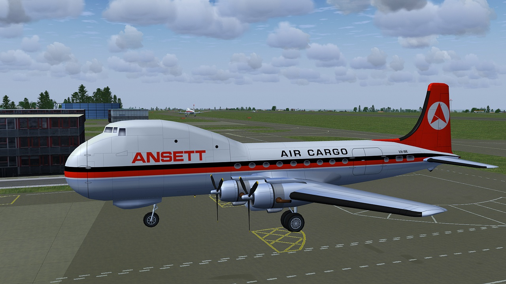

# Aviation Traders Carvair
### AI Aircraft for FlightGear
Work In Progress but is usable

carvair-BAF - British Air Ferries

carvair-EIN - Aer Lingus

carvair-EPA - Eastern Provincial Airways

carvair-ZK-NWA - Nationwide Air

carvair-AAA - Ansett

Download the zip file and extract the "Carvair" folder into the "$FG_ROOT/AI/Aircraft" folder.

To use you will need to create a traffic file, see the wiki for instructions.
 http://wiki.flightgear.org/AI_Traffic

A simple AI Traffic Creator (Python and a 64 bit windows) is available here: 
https://github.com/gooneybird47/FlightGear-AI-Traffic-Creator